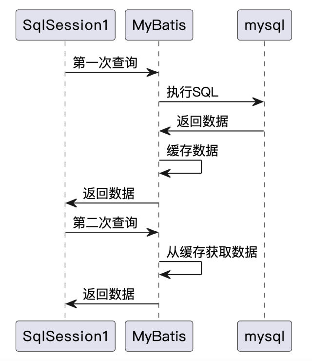
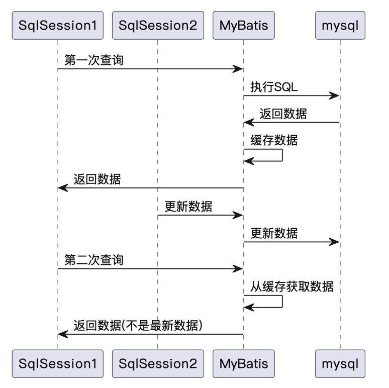
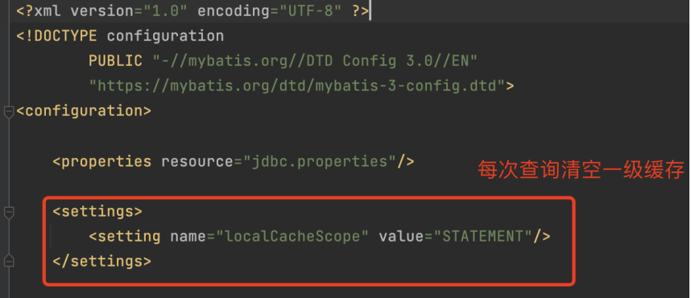
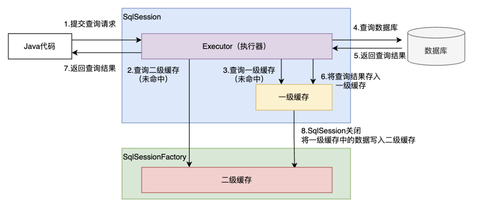
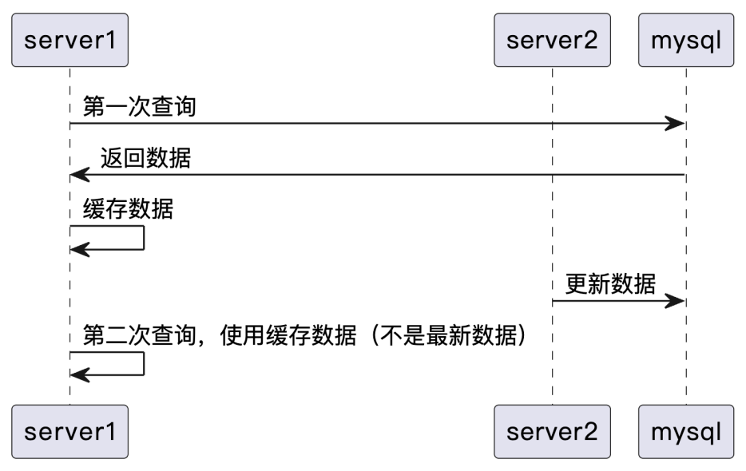

# MyBatis
## 1. 创建第一个Mybatis项目
1. 创建数据表，并插入数据
2. 引入 MyBatis / Mysql jdbc 包依赖
3. 创建并编辑核心配置文件 mybatis-config.xml
4. 定义 POJO 类
5. 创建并编辑 SQL 映射文件 xxxMapper.xml
6. 加载核心配置文件，获取 SqlSessionFactory 对象
7. 获取 SqlSession 对象
8. 执行 SQL 语句
9. 释放资源

## 2. GetMapper 原理解析
- 调用 getMapper 方法时，MyBatis 使用动态代理技术生成 mapper 接口的实例。
- 生成的 mapper 接口实例会拦截所有方法调用，并将方法调用转发 SqlSession。
- SqlSession 调用与 mapper 接口对应的 mapper xml 中的 SQL 语句。

# 核心配置文件
## properties
### 方式1
properties: 属性。用键值对的方式配置属性值，用配置的属性替换配置文件中的值

（不推荐）第 1 种方式：直接在 properties 标签下配置 property

### 方式2
（推荐）第 2 种方式：配置 properties 文件

### 分环境配置
可以在不同环境使用不同的 properties 文件，从而实现不同环境使用不同的属性值。

在 pom.xml 文件中配置 profiles 环境配置

在 pom.xml 文件中配置 resources 打包配置 

实现在不同环境使用不同的 properties 文件
**使用idea**

**使用maven command**

## typeAliases
mybatis文件：配置 package 为包路径下的所有类配置类型别名，类型别名 = 类名

## mappers
### 方式1
使用相对于类路径的资源引用

### 方式2
使用映射器接口的完全限定类名

### 方式3
将包内的映射器接口全部注册为映射器
注意：如果使用方式3，要求 mapper xml 文件和 mapper 接口类所在的路径要完全相同

# Mybatis 缓存

## 缓存概述
缓存是数据交换的缓冲区（称作Cache），是临时存贮数据（一般是使用频繁的数据）的地方。当用户查询数据，首先在缓存中寻找，如果找到了则直接返回。如果找不到，则去数据的来源查找 。  
缓存的本质就是用空间换时间，牺牲数据的实时性，以内存中的数据暂时替代从外部读取数据，达到减轻服务端压力，减少网络延迟的效果。

## Mybatis 缓存分类

### 一级缓存
MyBatis 一级缓存是 SqlSession 级别的，通过同一个 SqlSession 查询的结果会被缓存。下次查询相同的数据时，就会从缓存中直接获取，不会查询数据库。  

#### 概念
- MyBatis 一级缓存是默认开启的。
- 命中一级缓存要求以下相同：SqlSession，namespace，执行方法，SQL，参数。

#### 一级缓存失效条件
- 不同的 SqlSession
- 同一个 SqlSession，不同的查询条件
- 缓存被清空
  - SqlSession 内执行了增、删、改会清空一级缓存
  - 执行 SqlSession 的 clearCache 方法会清空一级缓存

#### 一级缓存问题以及如何禁用
一级缓存的问题：数据实时性得不到保障。如果其他 SqlSession 变更了数据，当前 SqlSession 查到的可能就不是最新数据。

强制不使用一级缓存  
在 mybatis-config.xml 核心配置文件中增加配置

### 二级缓存

#### 概念
MyBatis 二级缓存是 SqlSessionFactory 级别的，通过同一个 SqlSessionFactory 创建的 SqlSession查询的结果会被缓存。下次查询相同的数据时，就会从缓存中直接获取，不会查询数据库。  
MyBatis 二级缓存是默认关闭的。

#### 怎么使用
使用二级缓存的步骤
- mapper.xml 文件中添加标签 <cache/>
- POJO 类实现 Serializable 接口
- 关闭 session，一级缓存中的数据才会写入到二级缓存

#### 怎么失效
执行增、删、改会清空二级缓存

### Mybatis缓存查询顺序
- 先查询二级缓存，命中二级缓存则直接使用二级缓存中的数据
- 二级缓存未命中，查询一级缓存，一级缓存命中则直接使用一级缓存中的数据
- 一级缓存未命中，查询数据库，将查询结果存入一级缓存
- SqlSession 关闭，将一级缓存中的数据写入二级缓存

### 为什么不推荐使用二级缓存
二级缓存的生命周期比一级缓存长，数据实时性更难以保障。
