# MyBatis
## 1. 创建第一个Mybatis项目
1. 创建数据表，并插入数据
2. 引入 MyBatis / Mysql jdbc 包依赖
3. 创建并编辑核心配置文件 mybatis-config.xml
4. 定义 POJO 类
5. 创建并编辑 SQL 映射文件 xxxMapper.xml
6. 加载核心配置文件，获取 SqlSessionFactory 对象
7. 获取 SqlSession 对象
8. 执行 SQL 语句
9. 释放资源

## 2. GetMapper 原理解析
- 调用 getMapper 方法时，MyBatis 使用动态代理技术生成 mapper 接口的实例。
- 生成的 mapper 接口实例会拦截所有方法调用，并将方法调用转发 SqlSession。
- SqlSession 调用与 mapper 接口对应的 mapper xml 中的 SQL 语句。

# 核心配置文件
## properties
### 方式1
properties: 属性。用键值对的方式配置属性值，用配置的属性替换配置文件中的值
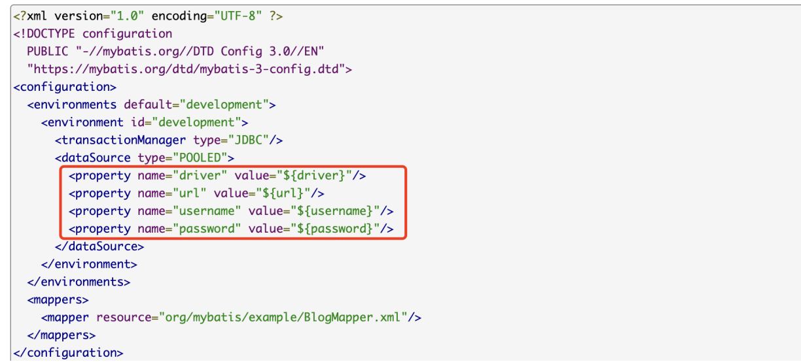

（不推荐）第 1 种方式：直接在 properties 标签下配置 property
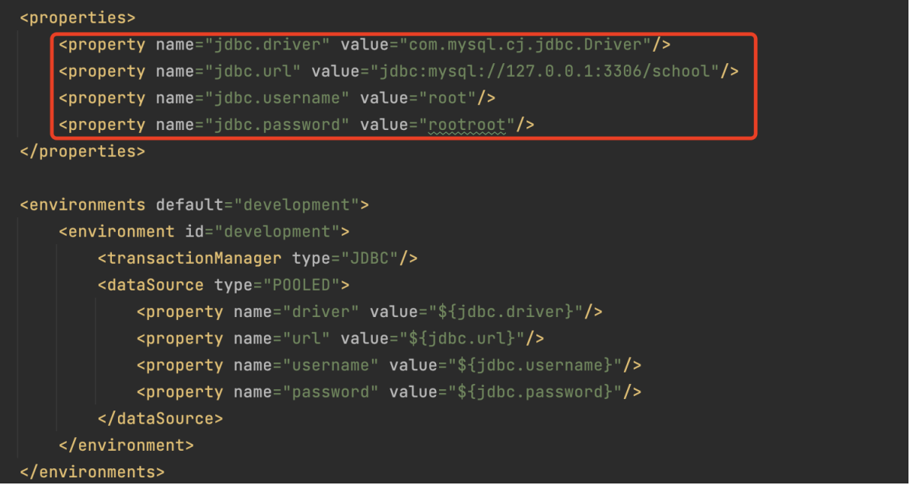

### 方式2
（推荐）第 2 种方式：配置 properties 文件
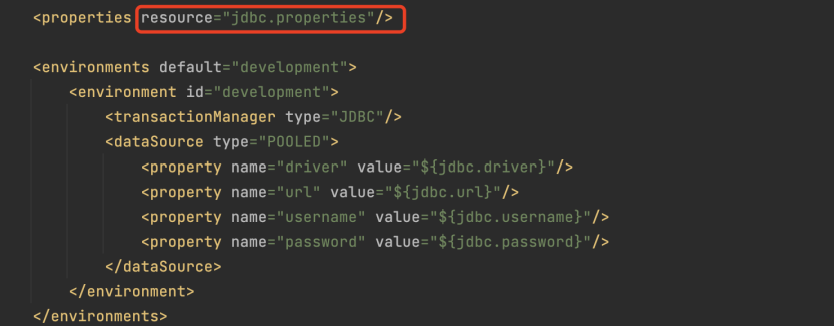
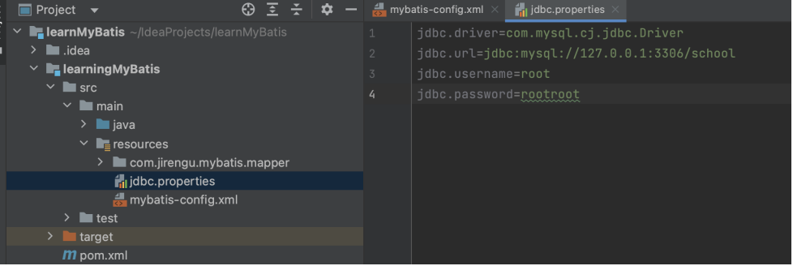

### 分环境配置
可以在不同环境使用不同的 properties 文件，从而实现不同环境使用不同的属性值。
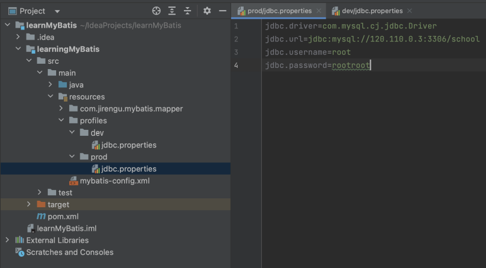
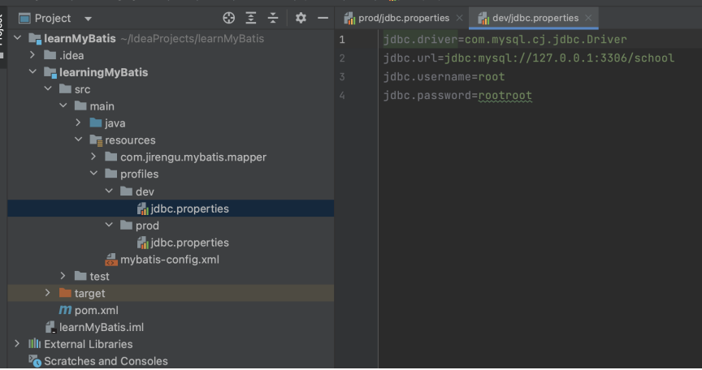

在 pom.xml 文件中配置 profiles 环境配置
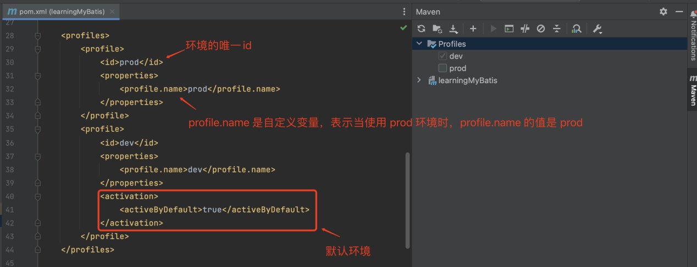

在 pom.xml 文件中配置 resources 打包配置 
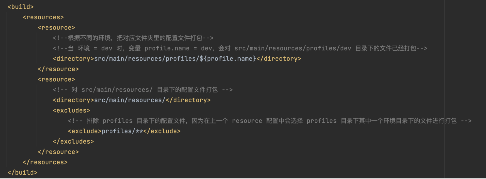

实现在不同环境使用不同的 properties 文件
**使用idea**
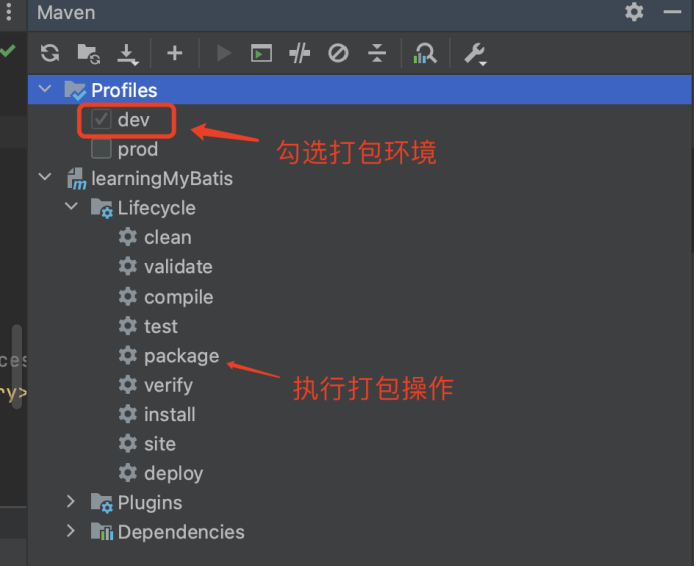

**使用maven command**
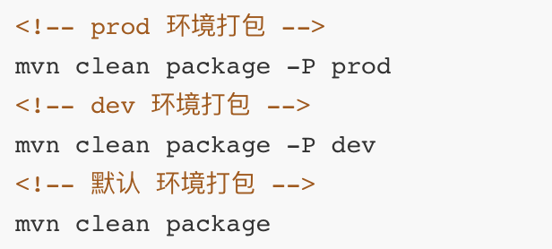

## typeAliases
mybatis文件：配置 package 为包路径下的所有类配置类型别名，类型别名 = 类名
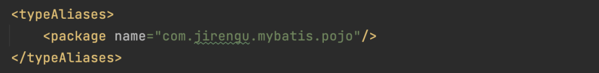

## mappers
### 方式1
使用相对于类路径的资源引用
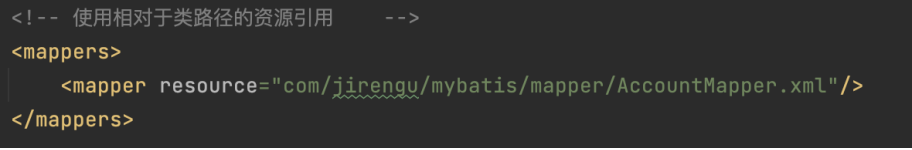

### 方式2
使用映射器接口的完全限定类名
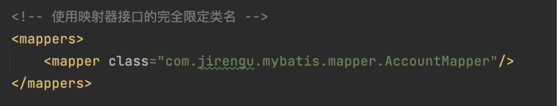

### 方式3
将包内的映射器接口全部注册为映射器
注意：如果使用方式3，要求 mapper xml 文件和 mapper 接口类所在的路径要完全相同
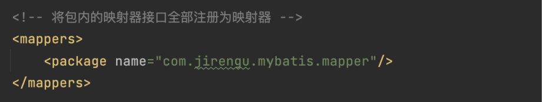