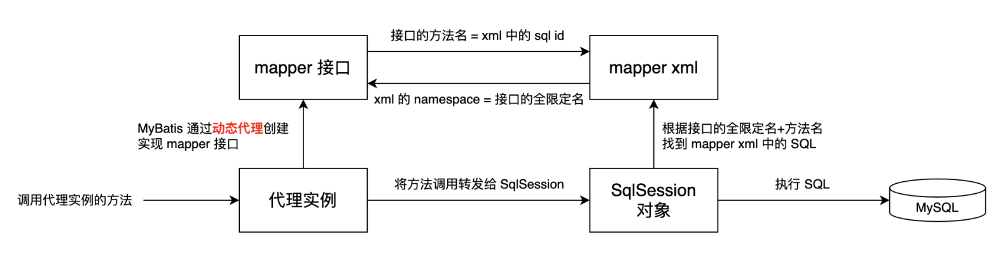

# MyBatis
## 1. 创建第一个Mybatis项目
1. 创建数据表，并插入数据
2. 引入 MyBatis / Mysql jdbc 包依赖
3. 创建并编辑核心配置文件 mybatis-config.xml
4. 定义 POJO 类
5. 创建并编辑 SQL 映射文件 xxxMapper.xml
6. 加载核心配置文件，获取 SqlSessionFactory 对象
7. 获取 SqlSession 对象
8. 执行 SQL 语句
9. 释放资源

## 2. GetMapper 原理解析
- 调用 getMapper 方法时，MyBatis 使用动态代理技术生成 mapper 接口的实例。
- 生成的 mapper 接口实例会拦截所有方法调用，并将方法调用转发 SqlSession。
- SqlSession 调用与 mapper 接口对应的 mapper xml 中的 SQL 语句。

